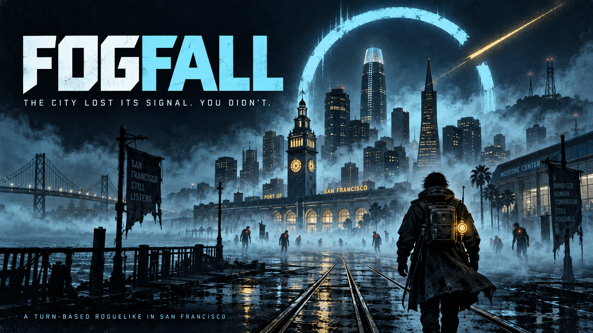
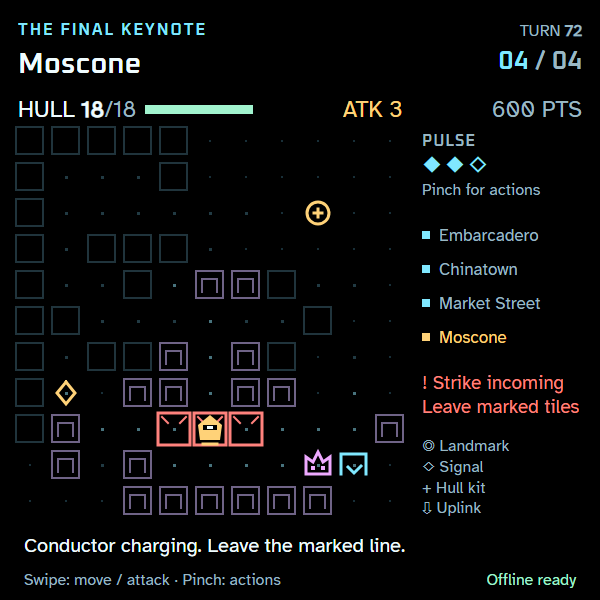
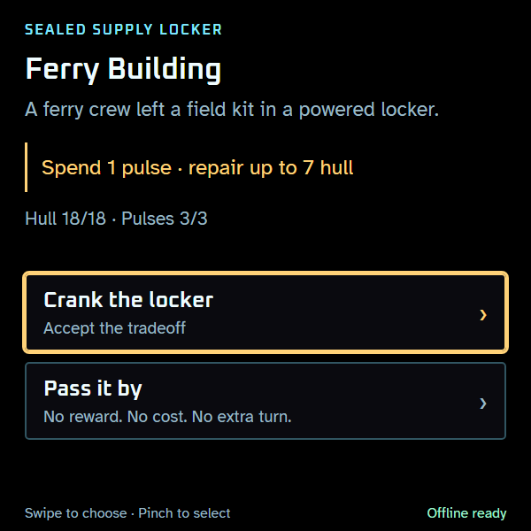
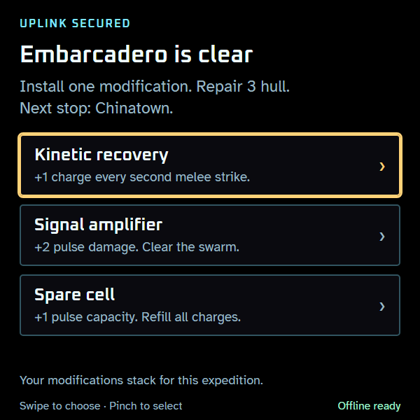
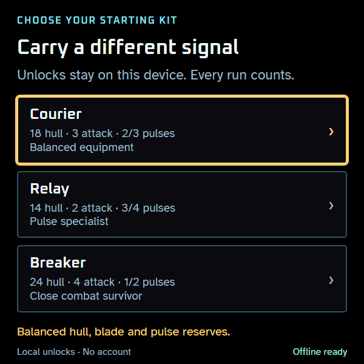
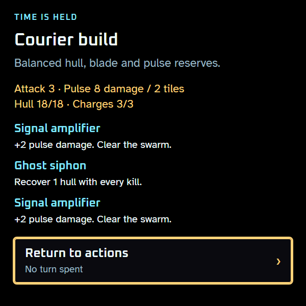
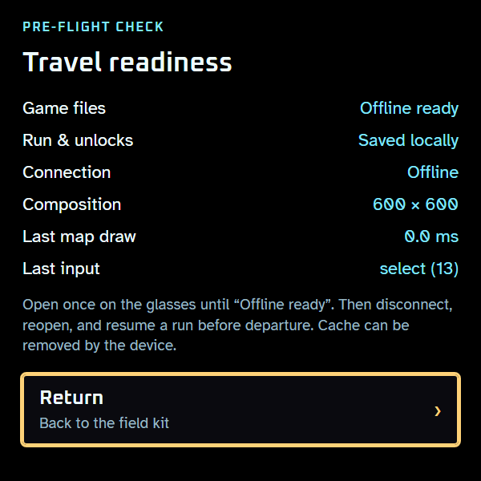
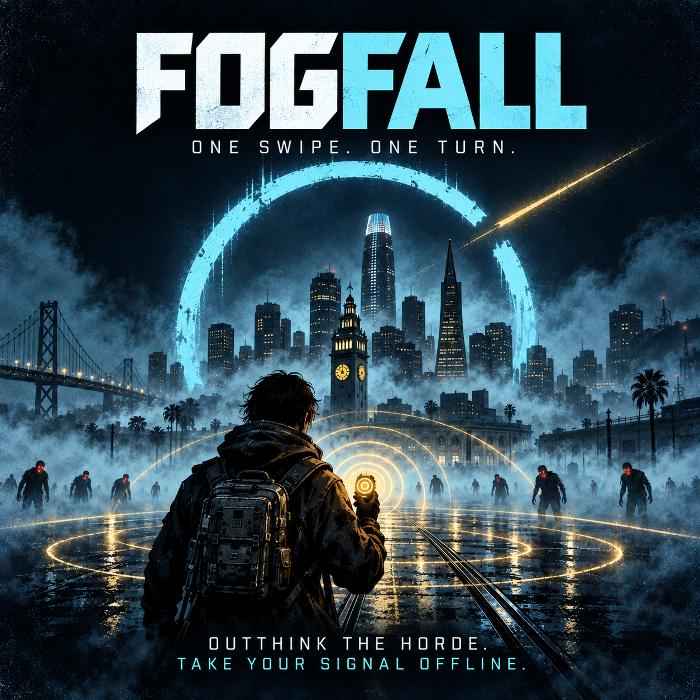
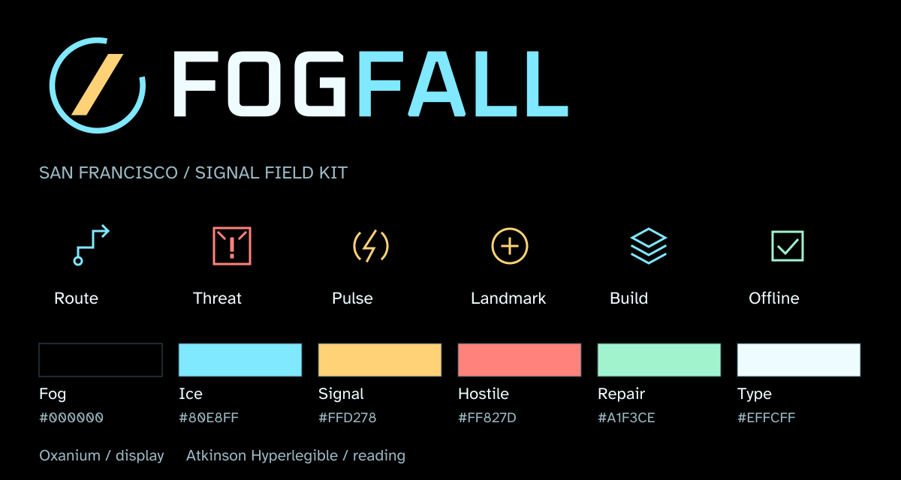

# FOGFALL · Rogue Vision

A short, turn-based sci-fi roguelike for Meta Ray-Ban Display and the Neural Band. Cross a signal-haunted San Francisco, modify your build, and shut down the corrupted Dreamforce keynote at Moscone.

**Play:** https://ehartye.github.io/rogue-vision/

## Gameplay

[](media/art/fogfall-cover.png)

**One swipe. One turn.** Cross four haunted districts, read the next strike, and carry your build to the final keynote. Put your hand down whenever you like—the city waits.

The cover is promotional illustration. The screenshots below show the actual 600×600 game UI captured in a desktop browser. Click any image for full resolution.

| Read the next strike | Make the detour count |
| :--- | :--- |
| [](media/screenshots/tactical-combat.png) | [](media/screenshots/landmark-deal.png) |
| Coral tiles warn before a strike lands. Move, attack, or disrupt the Conductor with a pulse. | Named landmarks offer optional deals. Check your supplies, accept the tradeoff, or pass safely. |

| Modify your expedition | Carry a different signal |
| :--- | :--- |
| [](media/screenshots/district-upgrade.png) | [](media/screenshots/starting-kits.png) |
| Each uplink offers three modifications. Add damage, repairs, capacity, or combat synergies. | Courier balances your tools. Unlock pulse-focused Relay and melee-focused Breaker through cumulative play. |

| Stack your modifications | Take it offline |
| :--- | :--- |
| [](media/screenshots/build-synergies.png) | [](media/screenshots/offline-ready.png) |
| Inspect your build without spending a turn. This run pairs stronger pulses with hull recovery on kills. | Cache the game online, then play and resume offline. Runs and earned unlocks stay on the device. |

### Artwork and brand kit

| Square promo | Reusable branding |
| :---: | :---: |
| [](media/art/fogfall-promo.png) | [](media/brand/brand-sheet.svg) |

[Download and use the media pack](media/README.md): cover and promo PNGs, transparent and monochrome wordmarks, SVG feature and kit icons, PNG avatars, and the full-resolution screenshot gallery.

## On the glasses

Add the public URL as a Web App in the Meta AI app (Developer Mode enabled). Open it on the glasses while online and wait for **Offline ready**. Start a run, disconnect, then reopen and resume to verify your device is ready for travel. First-time loading needs internet; later visits use the cached game. Device cache eviction or clearing app data requires another online visit.

Scan the [add-to-glasses QR code](assets/add-to-glasses.png) with your phone to open Meta's setup deep link. It was generated locally using Meta's official toolkit.

- **Swipe:** move one square; move into a hostile to attack.
- **Pinch:** open Pulse, Wait and More in the right panel while keeping the map visible. Pulse starts selected; pinch again to fire, or swipe to choose another action. Back returns to movement without spending a turn.
- **Back:** close the current screen with progress saved. Keep going back to reach the title; Back at the title is left to the native shell.
- **Pulse:** damages and disrupts nearby hostiles. Every third kill restores one charge.
- **Coral warning tiles:** a strike lands there next turn. Move away first.
- **Cyan uplink:** the lower-right exit. Install an upgrade between districts. Defeat the Conductor before the final extraction.
- **Lantern relay:** in new expeditions, Chinatown's uplink needs power. Stand at the gold lantern for three turns, or pulse within range to finish immediately. Arrival counts toward the three turns; progress survives moving away and reloading. Pinch → Tune relay holds position using the existing Wait action. Enemies keep acting while you work. Older saved expeditions retain their original objectives.
- **Gold landmark:** a ring, or Dragon Gate in Chinatown, marks an optional deal. Inspect the cost, then accept or pass safely. Each district has its own street pattern; supplies reward exploration away from the exit route.
- **More:** opens a modal for Your build and Sound. Inspect your starting kit and installed modifications without spending a turn. Aftershock strengthens melee attacks on disrupted enemies; Kinetic recovery recharges pulses through melee strikes. Upgrade effects stack. Back from either modal returns to the action panel.

Choose a starting kit before each new expedition. Courier is balanced and always available. Relay unlocks after 10 cumulative kills: less hull and blade damage, stronger pulses, and a charge refund for pulse multi-kills. Breaker unlocks after three cumulative district clears: more hull and blade damage, fewer pulses, and hull recovery on melee kills. Losses and abandoned runs contribute. Locks show progress, and swiping between kits explains their passive effect. Unlocks are local to this browser/device and are lost if its app data is cleared.

The game waits indefinitely for input. Saves occur at completed turns and upgrade selections. No accounts, telemetry, server, phone controller, sensors, or runtime third-party downloads. Sound is optional and starts disabled. Field kit → Travel readiness reports local cache/save status and the last map draw time; this is not a hardware benchmark.

New expeditions have more enemies in the first three districts, and ordinary enemies survive longer and hit harder. Attacks still warn before landing; dodge marked tiles or disrupt enemies with a pulse. Expeditions saved before this tuning retain their original balance when resumed, including future districts.

Field kit → Sound enables distinct synthesized action cues. Damage and imminent strikes take priority; combined combat outcomes retain their meaning, landmark trades have acceptance/refusal feedback, and the signal motif marks district uplinks and resolves at victory. Muting or hiding the app cancels pending sounds. Audio uses no downloaded assets. Browser renders check output and release envelopes; audibility on the glasses still needs a device listening check.

The lost-signal score develops that motif across four district arrangements at a fixed 72 BPM. Authored replies vary by run, with quiet space at phrase endings. Visible danger and hull pressure add texture; waiting to think never increases the tempo or advances the game. Music stops in menus, on mute and while hidden, and restarts without replaying missed notes. Action cues briefly lower the accompaniment.

## Develop and verify

Requires Node.js 24+.

```text
npm ci
npm test
npm run build
npx playwright install chromium
npm run test:browser
npm run audio:render
npm run balance
npm run dev
```

`audio:render` writes four native-browser WAV auditions, mix measurements and a playable `index.html` to `.artifacts/audio/`. Each sample moves from quiet exploration to pressure and ends with the victory resolution. Open that local HTML file to listen. These generated previews stay outside the production/offline bundle.

`balance` runs reproducible automated expeditions across all starting kits and three strategies, then writes district pressure, resource use and unlock-pacing reports to `.artifacts/balance/`. Add `-- --runs 100 --forks --sessions 20` for a larger matched-seed experiment with alternative upgrade continuations. Reports distinguish deaths from unfinished bot runs and preserve exact action replays. See [balance harness usage and interpretation](scripts/balance/README.md); bot outcomes do not establish human difficulty.

Preview at `http://127.0.0.1:4173/rogue-vision/`. Rebuild after editing. Arrow keys, Enter and Escape reproduce the discrete control vocabulary. The preview deliberately uses the same subpath as GitHub Pages.

`src/game.js` owns the seeded simulation and versioned save validation; `src/input.js` handles wrist keyCode-first normalization and duplicate filtering; `src/render.js` draws tactical overlays and people from the offline atlas; `src/scenery.js` joins discovered walls into district-specific buildings with continuous roofs, varied shop fronts, loading bays, bay windows and civic canopies. Scenery never consumes game randomness or changes a saved run. `src/app.js` owns menus, persistence and shallow history. The build bundles fonts and produces a PNG icon and content-versioned offline shell. Service workers retain a coherent release until old tabs close and remove only this app's caches. The earlier Chinatown frontage PNG remains an authoring reference; the game no longer loads or caches the repeated tile.

`src/waterfront.js` draws Embarcadero's Ferry Building clock tower, seawall and warehouse elevations. The tower marks the existing optional supply interaction; its gold threshold identifies the enterable square. The public beacon remains visible through fog, visited buildings become dim, and artwork stays below people and attack warnings.

`src/moscone.js` draws the registration entrance with glass doors, a sweeping canopy and gold threshold marks. Its public marker and dim visited state retain the existing badge encounter.

`src/transit.js` draws the Powell cable car over its existing public boarding encounter, plus crossing fragments on discovered Market Street intersections. Gold platform marks identify the enterable square; visited cars remain dim.

`src/kits.js` defines starting equipment; `src/profile.js` keeps a separate versioned progression record. It awards positive run deltas once and retains the last durable run receipt until a replacement save succeeds. Legacy run saves and stats migrate locally. Tests cover failed writes between the profile and run snapshots, including repeated failed new-run attempts.

GitHub Actions runs unit and browser checks, then publishes `dist/` on `main`. Configure Pages to use GitHub Actions. No production Node server is needed.

## Platform evidence

Implementation checked against Meta's [Web App AI Toolkit](https://github.com/facebook/meta-wearables-webapp), its display/performance and offline guidance, and the public Wearables documentation MCP. The local knowledge vault adds first-hand wrist event measurements. The design intentionally uses discrete input and event-driven drawing rather than assuming a continuous gesture or GPU budget.

Desktop browser tests verify cold offline reload, save restoration and keyboard navigation. Actual glasses legibility, input reliability, device offline relaunch and sustained battery use still require hardware testing.

Fonts: Oxanium and Atkinson Hyperlegible, distributed locally under the SIL Open Font License; license copies accompany the build. FOGFALL is an independent game, not an official Meta or Salesforce product.
